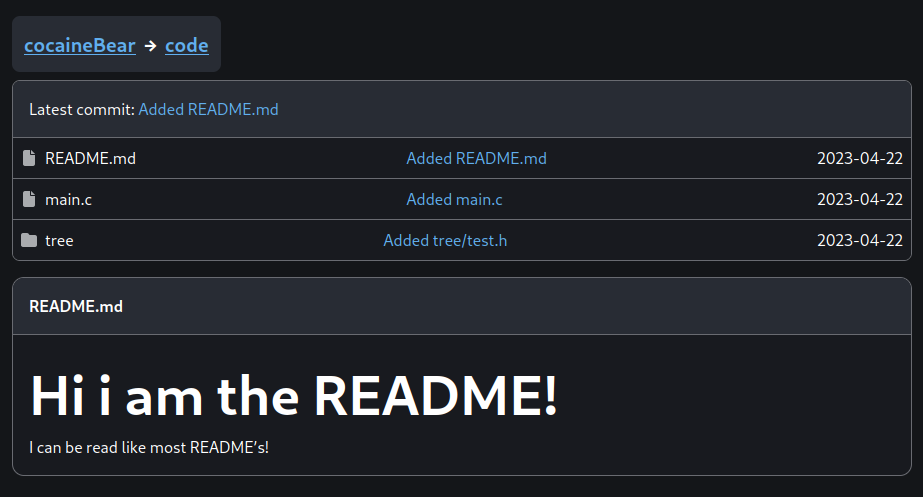

# Project: WIP

**! THE PROJECT IS IN IT'S VERY EARLY STAGES AS OF NOW IT IS NOT RECOMMENDED TO HOST IT BUT IT IS GETTING CLOSE TO BEING USEABLE FOR CASUAL THINGS SUCH AS A PERSONAL GIT SERVER !**

The backend and the frontend for the gitty platform written in elixir.

As of now this project is planned to include both the frontend and the backend this may change in the future if it proves non viable.

## Hosting: WIP

To host you will need to run two services: this one and the arbeiter which is also among my repositories (this may not be public at the time).

***In the future i plan on creating an easy to host docker image!***

## Technology

This service uses elixir on the frontend and the database side of things git operations are handled by the [**gitty arbeiter**](https://github.com/busyLambda/gitty_arbeiter) (gitty worker) which is written in rust and it uses the [**git2**](https://crates.io/crates/git2) crate!

## Images: WIP

Some previews of the service's frontend:

## LICENSE

The project is licensed under the terms of the [**MIT**](https://opensource.org/license/mit/) license as seen in the [LICENSE](./LICENSE) file.